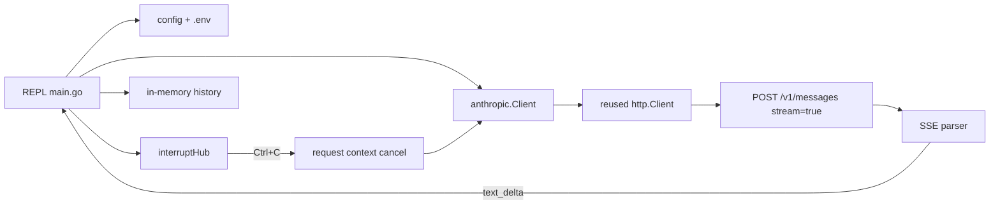

# terminalChat

A small Go CLI that chats with Anthropic’s Claude API over **raw `net/http` and SSE** — no Anthropic SDK.

Built as a learning / portfolio project for API clients, streaming protocols, cancellation, and careful error handling. It is **not** claimed to be production-ready.

## Why raw HTTP instead of an SDK?

- See the real wire protocol: headers, JSON body, Server-Sent Events.
- Control timeouts, cancellation, and incomplete-stream semantics explicitly.
- Keep dependencies at the Go standard library only.
- Make trade-offs (e.g. no overall `Client.Timeout` on long streams) visible in code and tests.

SDKs are fine for product work; this repo optimizes for understanding.

## Architecture



| Piece | Role |
|-------|------|
| `main.go` | REPL, signals, stdin loop |
| `config.go` | Flags, env precedence, validation |
| `env.go` | Optional `.env` (does not override existing env) |
| `interrupt.go` | Ctrl+C: cancel request vs exit |
| `session.go` / `history.go` | History append / rollback |
| `anthropic/` | HTTP client, SSE reader, timeouts, errors |

### Request lifecycle

1. Load optional `.env`, then parse/validate flags and env.
2. Append user message to in-memory history.
3. `POST /v1/messages` with `stream: true`, full history, and a **per-request** context.
4. Parse SSE; print `text_delta` chunks as they arrive.
5. Require a `message_stop` event for success; otherwise return `ErrIncompleteStream`.
6. On success, append assistant text. On error or cancel, **roll back** the user turn (partial screen text is not undone).

## Prerequisites

- Go 1.22+
- An Anthropic API key

## Setup

```bash
git clone <this-repo>
cd terminalChat_AI_written
cp .env.example .env
# edit .env and set ANTHROPIC_API_KEY=sk-ant-...
```

`.env` is gitignored. Never commit real keys. `.env.example` contains placeholders only.

```bash
go run .
# or
go build -o terminalchat .
./terminalchat
```

## Configuration

**Precedence (highest wins):** CLI flags → process environment (including `.env` for *unset* keys) → built-in defaults.

| Setting | Source | Default |
|---------|--------|---------|
| API key | `ANTHROPIC_API_KEY` only (no flag) | required |
| Model | `-model` or `ANTHROPIC_MODEL` | `claude-sonnet-4-5` |
| Max tokens | `-max-tokens` | `4096` (max `200000`) |
| System prompt | `-system` | empty |
| Header timeout | `-header-timeout` | `60s` |

Examples:

```bash
go run . -model claude-sonnet-4-5 -max-tokens 1024
go run . -system "Answer briefly" -header-timeout 30s
```

## Commands

| Command | Action |
|---------|--------|
| `/help` | Show commands and config notes |
| `/reset` | Clear conversation history |
| `/quit` or `/exit` | Exit |
| EOF (Ctrl+D) | Exit |

## Streaming and cancellation

- Replies stream over SSE (`content_block_delta` / `text_delta`).
- **Ctrl+C while Claude is replying:** cancel that request, roll back the user turn, return to `you>`.
- **Ctrl+C at the prompt:** exit.
- `/quit` and `/exit` exit cleanly.

Interrupt state is unit-tested via `interruptHub`. Full interactive TTY behavior can still differ by OS/terminal.

## Timeouts

Policy **A** (intentional):

- Dial and TLS handshake: 10s each
- Response **headers**: 60s (override with `-header-timeout`)
- **No** overall `http.Client.Timeout` — once headers arrive, the SSE body may run until the model finishes or you cancel with Ctrl+C

This avoids cutting off legitimate long generations.

## Known limitations

- Text-only chat (no tools, images, or files).
- History is in-memory only for the process lifetime.
- No automatic retries (avoids duplicating streamed tokens).
- Not a production SDK replacement; no SLA or security audit claimed.
- After `message_stop`, unread body bytes may not be fully drained before close.

## Development

```bash
make check   # gofmt clean, go vet, go test, go test -race
go test ./...
go test -race ./...
go vet ./...
```

Tests use `httptest` and in-memory SSE fixtures. They do **not** call the live API by default.

## Example session

```text
$ go run .
model claude-sonnet-4-5 — type /help for commands
Ctrl+C cancels an in-flight reply; Ctrl+C at the prompt exits
you> Say hi in three words.
claude> Hi there, friend!
you> /reset
history cleared
you> /quit
```

## License

Use and modify for learning and portfolio purposes as you see fit unless a LICENSE file says otherwise.
